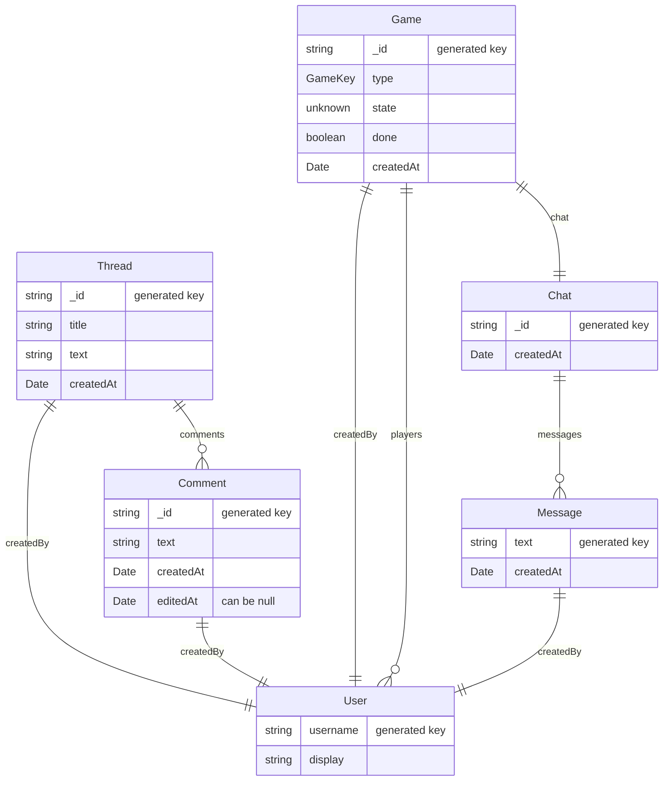

The individual and team project for this class are designed to mirror the experiences of a software engineer joining a new development team: you will be “onboarded” to our codebase, make several individual contributions, and then form a team to propose, develop and implement new features. The codebase that we'll be developing is Strategy Town, a website that answers the question "what if Twitch, but for correspondence chess?"

You will get an opportunity to work with the starter code which provides basic skeleton for the app and then additional features will be proposed and implemented by you! All implementation will take place in the TypeScript programming language, using React for the user interface.

## Getting Started

Run `npm install` in the root directory to install all dependencies for the `client`, `server`, and `shared` folders.

### Working on the application

While you're working on the application, it's useful to run it in "development mode" locally. Development mode watches files for changes and updates the application when changes happen. 

To run strategy.town locally in development mode, open two terminal windows:
 - In the first, navigate to the `server` directory and run `npm run dev`
 - In the second, navigate to the `client` directory and also run `npm run dev`

The second terminal window, the one in the `client` directory, shows a URL that you should go to to preview the application, probably <http://localhost:4530/>. You can use the default username/password combinations user0/pwd0, user1/pwd1, user2/pwd2, and user3/pwd3 to log in.

### Checking the application

Checks can be run on every part of the application at once by running the following commands from the repository root:

- `npm run check --workspaces` - Checks all three projects with TypeScript
- `npm run lint --workspaces` - Checks all three projects with ESLint
- `npm run test --workspaces` - Runs Vitest tests on all three projects

### Building the application

Running `npm run build -w=client` in the root of the repository will build the client. Then, the server can be started in production mode by running `npm start -w=server` and accessed by going to <http://localhost:8000/>.

## Codebase Folder Structure

- `client`: Contains the frontend application code, responsible for the user interface and interacting with the backend. This directory includes all React components and related assets.
- `server`: Contains the backend application code, handling the logic, APIs, and database interactions. It serves requests from the client and processes data accordingly.
- `shared`: Contains all shared type definitions that are used by both the client and server. This helps maintain consistency and reduces duplication of code between the two folders.

## API Routes

The server provides the following REST endpoints: requests are routed to these endpoints in `server/src/app.ts`.

#### `/api/game`

| Endpoint       | Method | Description                           |
| -------------- | ------ | ------------------------------------- |
| `/create`      | POST   | Create new game                       |
| `/list`        | GET    | List all games                        |
| `/:id`         | GET    | Get information about a specific game |

#### `/api/thread`

| Endpoint       | Method | Description                           |
| -------------- | ------ | ------------------------------------- |
| `/create`      | POST   | Create new forum post                 |
| `/list`        | GET    | List all forum posts                  |
| `/:id`         | GET    | Get information about a form post     |
| `/:id/comment` | POST   | Add a comment to a forum post         |

#### `/api/user`

| Endpoint       | Method | Description                           |
| -------------- | ------ | ------------------------------------- |
| `/list`        | POST   | Get details of a list of users        |
| `/login`       | POST   | Validate username/password entry      |
| `/signup`      | POST   | Create a new user                     |
| `/:username`   | POST   | Update user's displayname or password |
| `/:username`   | GET    | Get information about a user          |

### Websockets

The Socket.io API for event-driven communication between clients and the server is detailed in `shared/src/socket.types.ts`.

## Data Architecture

This web application stores information about users, forum posts, and games. The structure of the data can be described by this diagram:

